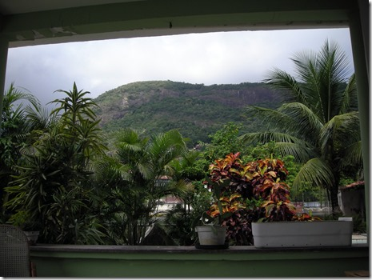

Hetkel on plaan elada Rio de Janeiros aasta aega. AIESECi tudengipraktika raames tegutsema hakkan ettevõttes nimega AMS Kepler. Tegevusalaks on GIS (remote sensing ja sellega seonduv) ja tarkvara arendus.

Rio on suur ja transport võtab kaua aega. [Koht kus ma elan](http://goo.gl/maps/6h338) on turistide piirkonnast ja kesklinnast päris kaugel (40 minutit bussiga). Barra da Tijuca on Rio üks turvalisemaid piirkondi. Samas on ta kallis ka. Seda enam, et elan [saare](http://goo.gl/maps/6h338) peal ja ainus võimalus sinna saada on paadiga. Vee-ühistranspordil on eraldi peatus meie jaoks - see tähendab, et ainult meie maja elanikel põhjust siin peatust paluda. Nii hoolitsevad need ühistranspordi juhid e paadimehed justkui ka turvalisuse eest ja loodetavasti kahtlaseid nägusid siia ei vea. Tegelikult olen juba järgi uurinud kuidas siit ilma paadita saare tänavate peale saab – natuke veidi ahvi kombel ronimist ja kohal. Loodame, et bandiidid on laisad ja ei viitsi ronida.

Ookean on poole tunni kaugusel - selleks peab olenevalt soovist, kuhu tahta välja jõuda ühe või kahe paadiga sõitma ja veidi kõndima. Linnulennul on ookean ca 1,5km. Eile ja täna käisin rannas jõin [kookospähkli vett](http://en.wikipedia.org/wiki/Coconut_water) ja hiljem sõin selle sisu ära. Proovisin ka [açai](http://en.wikipedia.org/wiki/A%C3%A7a%C3%AD_palm#Food_product)d, mis on väga väga maitsev ja toitev.

See pilt on tehtud mu arvutilaua tagant.

